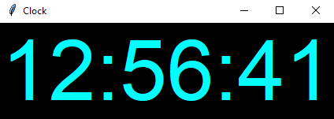

# Digital Clock

This Python program implements a digital clock using the Tkinter library. It displays the current time in hours, minutes, and seconds.



## Table of Contents

- [Features](#features)
- [Usage](#usage)
- [Contributing](#contributing)
- [License](#license)

  
## Features

- Real-time display of hours, minutes, and seconds.
- Update every second to show the current time accurately.
- Stylish digital font for the clock display.
- Simple and intuitive user interface.

## Usage

1. **Run the Program**: Execute the Python script to start the digital clock:
    ```
    python Clock.py
    ```

2. **View Time**: The clock will automatically display the current time in a digital format with hours, minutes, and seconds.

3. **Continuous Update**: The clock updates every second to reflect the current time accurately.

## Contributing
Contributions are welcome! If you'd like to contribute to this project, please follow these steps:

1. Fork this repository.
2. Create a branch:
```bash
git checkout -b feature/new-feature
```
3. Commit your changes:
```bash
git commit -m 'Add some feature'
```
4. Push to the branch:
```bash
git push origin feature/new-feature
```
5. Create a pull request.

## License

This project is licensed under the MIT License
